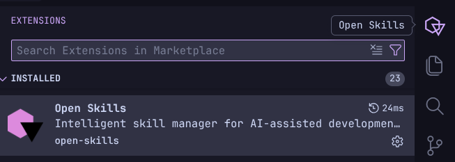
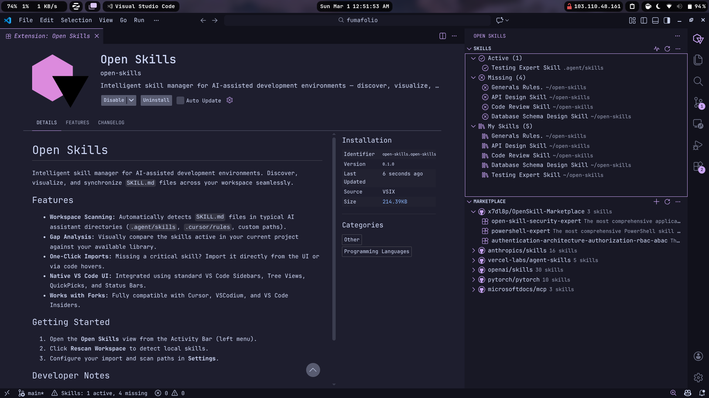
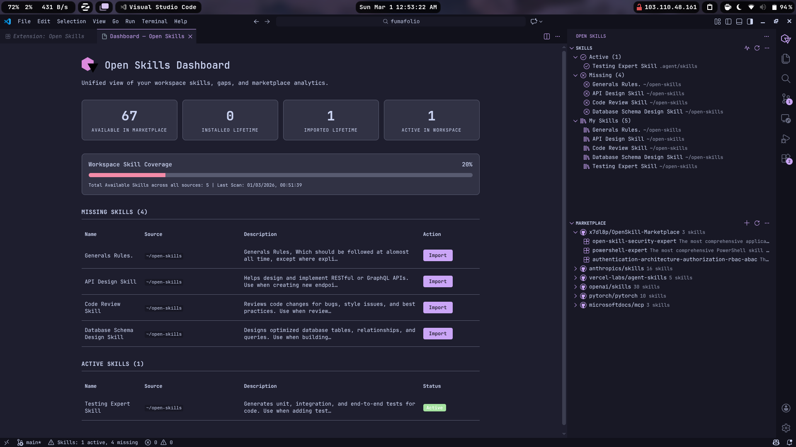

# Open Skills

A skill manager to make AI actually useful! Discover, visualize, and synchronize `SKILL.md` files across your workspace seamlessly.

## Usage

Go to:

Basic enough for everyone to use. For those needing documentation to understand how to use it, please don't bother using it!

Dashboard:

## Features

- **Workspace Scanning:** Automatically detects `SKILL.md` files in typical AI assistant directories (`.agent/skills`, `.cursor/rules`, custom paths).
- **Gap Analysis:** Visually compares the skills active in your current project against your available library.
- **One-Click Imports:** Missing a critical skill? Import it directly from the UI or by hovering over the skill name.
- **Native VS Code UI:** Integrated using standard VS Code sidebars, tree views, QuickPicks, and status bars.
- **Works with Forks:** Fully compatible with Cursor, VS Code, Antigravity, and others.

## Supported Repositories

These repositories are indexed in the marketplace by default:

| Repository | Skills Path |
|---|---|
| [x7dl8p/OpenSkill-Marketplace](https://github.com/x7dl8p/OpenSkill-Marketplace) | `skills/` |
| [anthropics/skills](https://github.com/anthropics/skills) | `skills/` |
| [vercel-labs/agent-skills](https://github.com/vercel-labs/agent-skills) | `skills/` |
| [openai/skills](https://github.com/openai/skills) | `skills/.curated` |
| [pytorch/pytorch](https://github.com/pytorch/pytorch) | `.claude/skills` |
| [microsoftdocs/mcp](https://github.com/microsoftdocs/mcp) | `skills/` |
| [huggingface/skills](https://github.com/huggingface/skills) | `skills/` |
| [skillcreatorai/Ai-Agent-Skills](https://github.com/skillcreatorai/Ai-Agent-Skills) | `skills/` |
| [ComposioHQ/awesome-claude-skills](https://github.com/ComposioHQ/awesome-claude-skills) | root |
| [K-Dense-AI/claude-scientific-skills](https://github.com/K-Dense-AI/claude-scientific-skills) | `scientific-skills/` |
| [pbakaus/impeccable](https://github.com/pbakaus/impeccable) | `source/skills` |
| [alirezarezvani/claude-skills](https://github.com/alirezarezvani/claude-skills) | root |
| [obra/superpowers](https://github.com/obra/superpowers) | `skills/` |

You can add your own repositories via the **Add Repository** button in the Marketplace panel.

## Developer Notes

Don't walk into my home with shoes on! Contributions are welcome, but don't be surprised if I just adapt your code and make it better. Just kidding (maybe!).